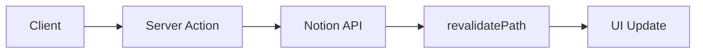

# 🚀 CLAUDE.md

> **Claude Code Configuration**  
> This file provides guidance to Claude Code (claude.ai/code) when working with code in this repository.

---

## ⚡ Development Commands

### 🏗️ Core Development
```bash
# 🔥 Development server with turbopack
pnpm dev

# 📦 Build for production
pnpm build

# 🚀 Start production server
pnpm start

# 🔍 Lint code
pnpm lint
```

### ☁️ Cloudflare Pages Deployment
```bash
# 📦 Build for Cloudflare Pages
pnpm pages:build

# 👀 Preview locally with Wrangler
pnpm preview

# 🚀 Deploy to Cloudflare Pages
pnpm deploy

# 🔧 Generate Cloudflare types
pnpm cf-typegen
```

---

## 🏗️ Architecture Overview

**Feedbax** is a Next.js 15 feedback management system using **Notion as the primary database**. The architecture follows a server-first approach with extensive use of React Server Components and Server Actions.

### 🔄 Core Data Flow



### 🧩 Key Components

| Component | Path | Purpose |
|-----------|------|---------|
| 🗄️ **Data Access Layer** | `/src/lib/notion.ts` | All Notion API interactions |
| 🔐 **Authentication** | `/src/lib/auth.ts` + `/src/lib/server-auth.ts` | Simple cookie-based auth |
| ⚡ **Server Actions** | `/src/lib/actions.ts` | All write operations (create, vote, comment, subscribe) |
| 📝 **Types** | `/src/types/feedback.ts` | Core TypeScript definitions |
| 🌍 **Environment** | `/src/env.ts` | Environment variable validation with `@t3-oss/env-nextjs` |

---

## 🗄️ Notion Database Schema

The application expects a Notion database with these properties:

### 📋 Required Properties

| Property | Type | Purpose | Values |
|----------|------|---------|--------|
| **Title** | `title` | Feedback post title | - |
| **Description** | `rich text` | Detailed description | - |
| **Type** | `select` | Feedback category | Bug report, Feature request, Improvement, Question |
| **Status** | `status` | Current state | Backlog, Next Up, In Progress, Under Review, Done, Cancelled |
| **Votes** | `number` | Vote count | Integer |
| **Submitter** | `email` | User email | Valid email format |
| **Interests** | `rich text` | Subscription emails | Comma-separated emails |
| **Created At** | `date` | Creation timestamp | Auto-generated |
| **Updated At** | `date` | Last modified | Auto-updated |

---

## 🔐 Authentication System

### 🍪 Simple Cookie-Based Auth

| Layer | Implementation | Details |
|-------|---------------|---------|
| **Client-side** | Cookie management | 30-day expiration |
| **Server-side** | Cookie reading | Server components |
| **User Context** | React context | Client components |
| **Registration** | Simple form | No complex flow |
| **User Type** | TypeScript interface | `{ name: string; email: string; image?: string }` |

---

## 🌟 Key Features Implementation

### 👍 Voting System
- **🎯 Hook**: `useVoting` in `/src/lib/hooks/use-voting.ts`
- **💾 Storage**: localStorage for vote tracking
- **⚡ Optimistic Updates**: Immediate UI feedback before server confirmation
- **🔔 Auto-subscription**: Voting automatically subscribes users to posts

### 🎯 Interest Tracking
- **⚡ Server Action**: `subscribeToPostAction` in `/src/lib/actions.ts`
- **🔒 Privacy**: Email lists never sent to client, only boolean `subscribed` status
- **💾 Storage**: Comma-separated emails in Notion's `Interests` field
- **🛠️ Utilities**: `/src/lib/interest-utils.ts` for parsing/formatting

### 💬 Comments
- **🔗 Native Notion**: Uses Notion's built-in comment system
- **📝 Metadata**: Embedded user information in comments
- **🔔 Auto-subscription**: Commenting automatically subscribes users

---

## 📋 Code Conventions

> Following patterns from `.cursorrules`

### 🔧 TypeScript
- ✅ Prefer interfaces over types
- ❌ Avoid enums, use const maps
- 🎯 Functional components with proper prop interfaces

### 📁 File Structure
- 🏗️ Export component first, then subcomponents, helpers, types
- 🎯 PascalCase for components, camelCase for functions
- 📂 Lowercase with dashes for directories

### ⚡ Performance
- ⚡ Minimize 'use client', favor React Server Components
- 🌐 Use 'nuqs' for URL state, minimize global state
- 🎨 Shadcn UI + Tailwind CSS, mobile-first approach

---

## 🌍 Environment Variables

```bash
# 🔑 Notion Integration
NOTION_API_KEY=your_integration_token
NOTION_DATABASE_ID=your_database_id

# 🌐 Application
NEXT_PUBLIC_APP_URL=your_app_url
```

---

## 📝 Development Notes

### 🚀 Performance Optimizations
- **⚡ Edge Runtime**: Many routes use `export const runtime = "edge"`
- **🔄 Revalidation**: Server actions trigger `revalidatePath` for fresh data
- **🛡️ Error Handling**: Use early returns and guard clauses
- **✅ Form Validation**: Zod schemas for all form inputs
- **🔒 Type Safety**: Comprehensive TypeScript throughout

---

## 🛠️ Common Tasks

### ⚡ Server Actions
```typescript
// Add to /src/lib/actions.ts with proper validation
export async function newServerAction() {
  // Implementation
}
```

### 🧩 Components
```typescript
// Follow structure in /src/components/ with proper exports
export default function NewComponent() {
  // Implementation
}
```

### 📝 Schema Updates
- **Notion Changes**: Update types in `/src/types/feedback.ts`
- **Environment**: Add to `/src/env.ts` with validation

### 🚀 Deployment
```bash
# Build and deploy to Cloudflare Pages
pnpm pages:build
pnpm deploy
```

---

## 🧪 Testing

> The project structure supports testing but no specific test framework is configured.  
> Follow testing patterns from `.cursorrules` when adding tests.