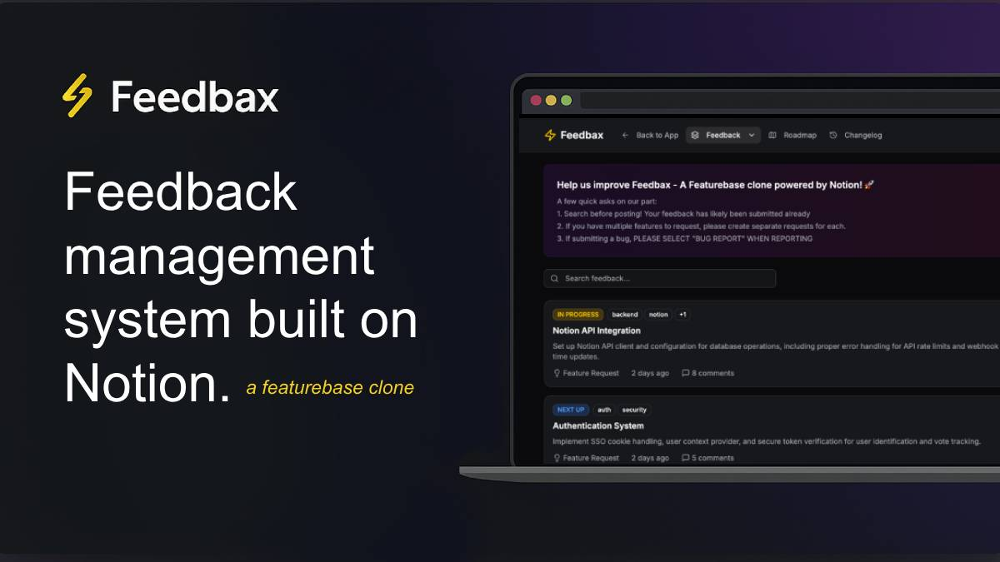

# 🚀 Feedbax



[](https://opensource.org/licenses/MIT)
[](https://nextjs.org/)
[](https://www.typescriptlang.org/)
[](https://developers.notion.com/)
[](https://pages.cloudflare.com/)

**Feedbax** is a modern, open-source feedback and roadmap system built with Next.js and Notion. It provides a beautiful, Featurebase-style interface for collecting, managing, and responding to user feedback while leveraging Notion as a powerful backend database.

> 🎯 **Perfect for**: Product teams, SaaS companies, open-source projects, and any organization that wants to build in public and engage with their community.

## ✨ Features

### 🎯 Core Features

- **📝 Feedback Management**: Submit, organize, and track feedback items with rich metadata
- **👍 Interactive Voting**: Upvote/downvote system with real-time vote tracking
- **💬 Threaded Comments**: Nested comment system for detailed discussions
- **🗺️ Public Roadmap**: Beautiful roadmap view with status tracking and filtering
- **📊 Analytics Dashboard**: Insights into feedback trends and user engagement
- **🔄 Real-time Updates**: Live updates via Notion webhooks and optimistic UI
- **🏷️ Smart Tagging**: Organize feedback with custom tags and categories

### 🎨 User Experience

- **🎨 Modern UI**: Clean, accessible interface built with Shadcn UI and Tailwind CSS
- **📱 Mobile-First**: Responsive design that works perfectly on all devices
- **🌙 Dark Mode**: Beautiful dark/light theme support with system preference detection
- **⚡ Performance**: Optimized for speed with Next.js 15 and edge runtime
- **♿ Accessibility**: WCAG 2.1 AA compliant with full keyboard navigation

### 🔧 Developer Experience

- **🚀 Next.js 15**: Latest features with App Router and Server Components
- **📘 TypeScript**: Full type safety with comprehensive type definitions
- **🏗️ Clean Architecture**: Proper separation of concerns with DAL, services, and UI layers
- **🧪 Testing Ready**: Structured for easy unit, integration, and E2E testing
- **📚 Documentation**: Comprehensive docs and inline code documentation
- **🔒 Security**: Built-in validation, sanitization, and error handling

## Interest Tracking Feature

The interest tracking feature allows users to subscribe to feedback posts and get notified when there are updates. Here's how it works:

### Implementation Details

1. **Database Schema**:

   - Added `Interests` field as a rich text property in Notion
   - Stores emails in comma-separated format: `,email1@example.com,email2@example.com`

2. **Privacy & Security**:

   - User emails are **never sent to the client** for privacy protection
   - Only a boolean `subscribed` field is sent to indicate if the current user is subscribed
   - All email list operations happen server-side
   - Server fetches current interests from Notion before making updates

3. **Frontend Integration**:

   - Subscribe/unsubscribe button in post detail modal
   - Optimistic updates for immediate user feedback
   - Visual indicators for subscription status
   - No exposure of other users' email addresses

4. **Backend Processing**:
   - Server action `subscribeToPostAction` handles subscription logic
   - Fetches current interests from Notion before updating
   - Automatic parsing and formatting of interest lists
   - Console logging for debugging and monitoring

### Usage

1. Open any feedback post in the detail modal
2. Click "Get notified" to subscribe to updates
3. Click "Unsubscribe" to remove yourself from notifications
4. The system tracks all interested users for future notification features

### Technical Implementation

```typescript
// Privacy-focused: Only boolean subscription status sent to client
interface FeedbackPost {
  // ... other fields
  subscribed?: boolean; // Whether the current user is subscribed
}

// Server-side: Email operations happen securely on the server
const subscribeToPostAction = async (data) => {
  // Fetch current interests from Notion
  const currentInterests = await fetchCurrentInterests(data.postId);

  // Add/remove user email server-side
  const updatedInterests = data.isSubscribing
    ? addUserToInterests(currentInterests, data.userEmail)
    : removeUserFromInterests(currentInterests, data.userEmail);

  // Update Notion with new interests list
  await updateNotionInterests(data.postId, updatedInterests);
};
```

### Privacy Benefits

- **No Email Exposure**: Other users' emails are never sent to the client
- **Server-Side Operations**: All email list manipulations happen securely on the server
- **Current User Context**: Server determines subscription status based on authenticated user
- **Secure Updates**: Direct server-to-Notion communication for interest updates

The interests are logged to console when fetching feedback posts for debugging purposes.

## Getting Started

### Prerequisites

- Node.js 18+ and npm/yarn
- A Notion account and workspace
- Basic knowledge of Next.js and TypeScript

### Installation

1. Clone the repository:

   ```bash
   git clone https://github.com/yourusername/feedbax.git
   cd feedbax
   ```

2. Install dependencies:

   ```bash
   npm install
   # or
   yarn install
   ```

3. Set up environment variables:

   ```bash
   cp .env.example .env.local
   ```

   Fill in your Notion API key and database ID in `.env.local`.

4. Set up Notion:

   - Create a new integration in [Notion Integrations](https://www.notion.so/my-integrations)
   - Create a new database in your Notion workspace
   - Share the database with your integration
   - Copy the database ID and integration token

5. Run the development server:

   ```bash
   npm run dev
   # or
   yarn dev
   ```

6. Open [http://localhost:3000](http://localhost:3000) in your browser.

## Configuration

### App Configuration

Feedbax uses a centralized configuration file (`src/config.ts`) that makes it easy to customize the application for your needs. Simply update the values in this file to change:

- **App Identity**: Name, tagline, description, and branding
- **URLs**: App URL, GitHub repository, documentation links
- **SEO & Metadata**: Title, description, keywords, and Open Graph settings
- **Welcome Messages**: Custom welcome text for different sections
- **Post Types**: Configure available feedback categories
- **UI Text**: Placeholder text, button labels, and messages

```typescript
// Example configuration
export const appConfig = {
  name: "Your App Name",
  tagline: "Your App Tagline",
  urls: {
    app: "https://yourapp.com",
    github: "https://github.com/yourname/yourapp",
  },
  branding: {
    logo: "🚀", // Can be emoji or icon
    colors: {
      primary: "blue",
      secondary: "indigo",
    },
  },
  // ... more configuration options
};
```

### Environment Variables

```env
NOTION_API_KEY=your_integration_token
NOTION_FEEDBACK_DB_ID=your_database_id
NEXT_PUBLIC_APP_URL=your_app_url
```

### Notion Database Setup

1. Create a new database in Notion with the following properties:

   - Title (title property)
   - Description (rich text)
   - Type/Category (select)
   - Status (select)
   - Votes (number)
   - Submitter (text)
   - Tags (multi-select)
   - Merged Into (relation)
   - Interests (rich text) - **New field for interest tracking**

2. Share the database with your integration

## Usage

### Feedback Management

- Users can submit new feedback items
- Vote on existing suggestions
- Comment on feedback items
- View the public roadmap
- Track feature status

### Admin Features

- Manage feedback directly in Notion
- Update status and categories
- Merge duplicate requests
- Respond to feedback via Notion comments
- Organize with tags

## Contributing

We welcome contributions! Please see our [Contributing Guide](CONTRIBUTING.md) for details.

1. Fork the repository
2. Create your feature branch (`git checkout -b feature/amazing-feature`)
3. Commit your changes (`git commit -m 'Add some amazing feature'`)
4. Push to the branch (`git push origin feature/amazing-feature`)
5. Open a Pull Request

## Development

### Tech Stack

- [Next.js](https://nextjs.org/) - React framework
- [TypeScript](https://www.typescriptlang.org/) - Type safety
- [Shadcn UI](https://ui.shadcn.com/) - UI components
- [Tailwind CSS](https://tailwindcss.com/) - Styling
- [Notion API](https://developers.notion.com/) - Backend database

### Scripts

```bash
npm run dev        # Start development server
npm run build      # Build for production
npm run start      # Start production server
npm run lint       # Run ESLint
npm run test       # Run tests
```

## Deployment

Feedbax is designed to be deployed on Cloudflare Pages using Wrangler. See our [Deployment Guide](docs/DEPLOYMENT.md) for detailed instructions.

## License

This project is licensed under the MIT License - see the [LICENSE](LICENSE) file for details.

## Acknowledgments

- Inspired by [Featurebase](https://featurebase.com/)
- Built with [Next.js](https://nextjs.org/)
- Powered by [Notion](https://notion.so/)

## Support

- [Documentation](docs/)
- [Issues](https://github.com/yourusername/feedbax/issues)
- [Discussions](https://github.com/yourusername/feedbax/discussions)

## Roadmap

See our [Roadmap](docs/ROADMAP.md) for planned features and improvements.

## Cloudflare integration

Besides the `dev` script mentioned above `c3` has added a few extra scripts that allow you to integrate the application with the [Cloudflare Pages](https://pages.cloudflare.com/) environment, these are:

- `pages:build` to build the application for Pages using the [`@cloudflare/next-on-pages`](https://github.com/cloudflare/next-on-pages) CLI
- `preview` to locally preview your Pages application using the [Wrangler](https://developers.cloudflare.com/workers/wrangler/) CLI
- `deploy` to deploy your Pages application using the [Wrangler](https://developers.cloudflare.com/workers/wrangler/) CLI

> **Note:** while the `dev` script is optimal for local development you should preview your Pages application as well (periodically or before deployments) in order to make sure that it can properly work in the Pages environment (for more details see the [`@cloudflare/next-on-pages` recommended workflow](https://github.com/cloudflare/next-on-pages/blob/main/internal-packages/next-dev/README.md#recommended-development-workflow))

### Bindings

Cloudflare [Bindings](https://developers.cloudflare.com/pages/functions/bindings/) are what allows you to interact with resources available in the Cloudflare Platform.

You can use bindings during development, when previewing locally your application and of course in the deployed application:

- To use bindings in dev mode you need to define them in the `next.config.js` file under `setupDevBindings`, this mode uses the `next-dev` `@cloudflare/next-on-pages` submodule. For more details see its [documentation](https://github.com/cloudflare/next-on-pages/blob/05b6256/internal-packages/next-dev/README.md).

- To use bindings in the preview mode you need to add them to the `pages:preview` script accordingly to the `wrangler pages dev` command. For more details see its [documentation](https://developers.cloudflare.com/workers/wrangler/commands/#dev-1) or the [Pages Bindings documentation](https://developers.cloudflare.com/pages/functions/bindings/).

- To use bindings in the deployed application you will need to configure them in the Cloudflare [dashboard](https://dash.cloudflare.com/). For more details see the [Pages Bindings documentation](https://developers.cloudflare.com/pages/functions/bindings/).

#### KV Example

`c3` has added for you an example showing how you can use a KV binding.

In order to enable the example:

- Search for javascript/typescript lines containing the following comment:
  ```ts
  // KV Example:
  ```
  and uncomment the commented lines below it (also uncomment the relevant imports).
- In the `wrangler.jsonc` file add the following configuration line:
  ```
  "kv_namespaces": [{ "binding": "MY_KV_NAMESPACE", "id": "xxxxxxxxxxxxxxxxxxxxxxxxxxxxxxxx" }],
  ```
- If you're using TypeScript run the `cf-typegen` script to update the `env.d.ts` file:
  ```bash
  npm run cf-typegen
  # or
  yarn cf-typegen
  # or
  pnpm cf-typegen
  # or
  bun cf-typegen
  ```

After doing this you can run the `dev` or `preview` script and visit the `/api/hello` route to see the example in action.

Finally, if you also want to see the example work in the deployed application make sure to add a `MY_KV_NAMESPACE` binding to your Pages application in its [dashboard kv bindings settings section](https://dash.cloudflare.com/?to=/:account/pages/view/:pages-project/settings/functions#kv_namespace_bindings_section). After having configured it make sure to re-deploy your application.
